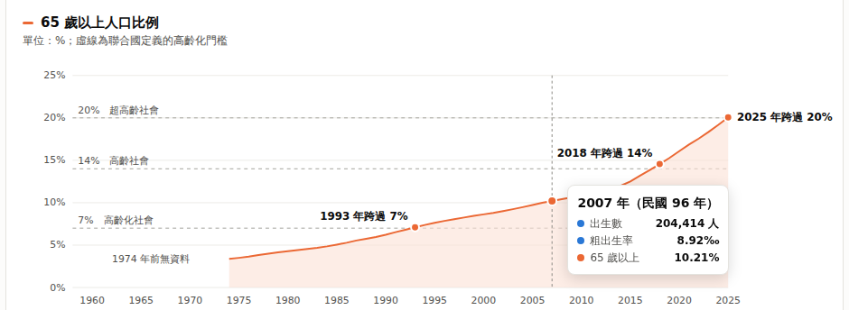

# 1151VIS-HW1：台灣少子化與高齡化（Vue 3 + D3.js 靜態視覺化）

- 學號／姓名：414085208／曾辰哲
- GitHub：https://github.com/Irving0522/1151VIS-HW1-414085208-TsengChenChe
- 執行錄影：[images/demo.gif](images/demo.gif)

## 1. 專案截圖

執行錄影：開啟頁面、捲動，再用滑鼠查看兩張圖的數值。


靜態截圖：


滑鼠移到圖上時，兩張圖會同步顯示垂直線，並跳出提示框：



## 2. 主題與資料

**主題：** 出生越來越少，老人越來越多。用上下兩張圖呈現台灣少子化與高齡化的長期趨勢，並標出 2025 年 65 歲以上人口跨過 20%「超高齡社會」門檻的時間點。

**資料來源：** 內政部戶政司「人口統計資料 → 快速下載」

| 檔案 | 內容 | 年份 |
|---|---|---|
| 出生數及粗出生率按登記及發生.xls（工作表「全國(登記)」） | 每年出生數、粗出生率 | 1958–2025 |
| 人口年齡結構指標.xls | 各年齡層人口數與比例 | 1974–2025 |

## 3. 使用技術

| 技術 | 用途 |
|---|---|
| Vue 3（`<script setup>` 單檔元件） | 頁面結構、元件化、響應式狀態（hover 同步） |
| D3.js v7 | 讀檔與清理資料、比例尺、折線與面積路徑、刻度計算、滑鼠位置換算 |
| Vite | 開發伺服器與打包 |

**Vue 與 D3 的分工：** D3 負責「計算」，包括比例尺、`d3.line`／`d3.area` 產生的路徑字串、刻度，以及從滑鼠位置換算年份。Vue 負責「畫出來」，在 `<template>` 裡用 `v-for`、`:d`、`:x` 等綁定產生 SVG。兩邊都不直接操作 DOM，資料一改，畫面就自動更新。

## 4. 製作流程

### Step 1：建立 Vue 3 專案
```bash
npm create vite@latest      # 選擇 Vue → JavaScript
npm install
npm install d3
```

### Step 2：取得資料並另存 CSV
1. 從內政部戶政司網站下載兩份 XLS。
2. 用 Excel 開啟，出生數的檔案先切換到「全國(登記)」工作表。
3. 另存新檔，類型選「CSV UTF-8（逗號分隔）」，分別存成 `public/data/births_raw.csv` 和 `public/data/age_raw.csv`。
4. 表格內容不做任何手動修改，清理工作全部交給 D3。

### Step 3：用 D3.js 清理與合併資料（`src/utils/population.js`）
原始表格有多層標題、合併儲存格和民國年，不能直接當資料表使用，所以用 D3 處理：

1. `d3.buffer()` 讀入原始位元組，再用 `TextDecoder` 判斷編碼是 UTF-8 還是 Big5。
2. `d3.csvParseRows()` 把檔案逐列讀成陣列，不依賴標題列。
3. 用正規表示式找出第一欄是「民國NN年」的資料列，民國年加 1911 換成西元年。
4. 自訂 `num()` 函式，處理千分位逗號，以及「…」「-」這類缺值符號。
5. 用 `d3.index()` 依年份合併兩份資料。1958–1973 年沒有年齡資料，這些欄位設為 `null`。

### Step 4：元件設計

| 檔案 | 負責內容 |
|---|---|
| `src/App.vue` | 在 `onMounted` 載入資料，計算重點數字（高峰年、跨門檻年份等），再分給各元件；hover 狀態也放在這裡統一管理 |
| `src/components/StatCards.vue` | 上方三張數字卡 |
| `src/components/LineChart.vue` | 通用的折線＋面積圖，用 props 決定畫哪個欄位、顏色、門檻線和標註，同一個元件畫出兩張圖 |
| `src/components/HoverTooltip.vue` | 跟著滑鼠移動的提示框，靠近右邊時自動改放左側 |

### Step 5：繪圖重點（`LineChart.vue`）

| 元素 | 做法 |
|---|---|
| 年份軸（兩張圖共用） | `d3.scaleLinear` 加上 `scale.ticks()`，用 `v-for` 畫出刻度 |
| 折線與面積 | `d3.line()`、`d3.area()` 產生路徑字串，綁到 `<path :d>` |
| 高齡化門檻虛線（7%／14%／20%） | `thresholds` props 搭配 `v-for` |
| 標註（1963 高峰、2012 龍年、2025 新低、跨門檻年份） | 用 `d3.greatest`、`Array.find` 從資料中找出，不寫死 |
| 滑鼠提示 | `d3.pointer` 取得滑鼠座標，`x.invert` 換算成年份，`d3.bisector` 找出最近的資料；子元件用 `emit('hover')` 回傳給 App，App 再把 `hoverYear` 傳給兩張圖，兩張圖因此同步 |

### Step 6：設計考量
- **不用雙 Y 軸：** 出生數（人）和比例（%）單位不同，所以拆成上下兩張圖，共用同一條年份軸。
- **配色一致：** 藍色代表出生、橘色代表高齡，從圖例、線條到 tooltip 都維持同一組顏色。
- **數字由資料驅動：** 內文、數字卡、標註都從資料計算，換新年度的資料後會自動更新。
- **深色模式：** 用 CSS 變數搭配 `prefers-color-scheme`，依系統設定自動切換。

## 5. 執行方式與相關操作

需要先安裝 [Node.js](https://nodejs.org/)，建議 20 以上的版本。

```bash
npm install        # 第一次執行時安裝套件
npm run dev        # 啟動開發伺服器，打開終端機顯示的網址（通常是 http://localhost:5173）
npm run build      # 打包成 dist/ 資料夾（選用）
```

| 操作 | 方法 |
|---|---|
| 查看某一年數值 | 滑鼠移到任一張圖上，兩張圖會同步出現垂直線和圓點，提示框顯示出生數、粗出生率、65 歲以上比例 |
| 檢查資料是否讀對 | 按 F12 開啟 Console，可以看到最後三年的資料表 |
| 更新資料 | 用新的 Excel 另存 CSV，覆蓋 `public/data/` 裡同名的檔案，重新整理頁面即可 |

## 6. GitHub 上傳與分享流程

1. **建立 repository：** 在 GitHub 點「New repository」，名稱設為 `1151VIS-HW1-學號-姓名`，Visibility 選 Public，`.gitignore` 選 HTML。
   <!-- 截圖：images/step1-create-repo.png -->
2. **上傳專案：** 點「uploading an existing file」（或「Add file → Upload files」），把專案資料夾裡除了 `node_modules`、`dist` 以外的所有檔案和資料夾拖進去，再按「Commit changes」。
   <!-- 截圖：images/step2-upload.png -->
3. **分享給老師：** 到「Settings → Collaborators → Add people」，輸入 `cchu.fju@gmail.com` 並送出邀請。
   <!-- 截圖：images/step3-collaborator.png -->
4. **執行與錄影：** 執行 `npm run dev` 開啟頁面，錄下關鍵畫面：開啟頁面、瀏覽兩張圖、滑鼠查看數值、按 F12 顯示 Console 的資料表。

## 7. 檔案結構

```
1151VIS-HW1-414085208-TsengChenChe/
├── index.html                  Vite 入口頁
├── package.json                套件與指令
├── vite.config.js              Vite 設定
├── .gitignore                  忽略 node_modules、dist
├── README.md                   本說明文件
├── public/data/
│   ├── births_raw.csv          出生數原始 CSV
│   └── age_raw.csv             年齡結構原始 CSV
├── src/
│   ├── main.js                 建立 Vue app
│   ├── style.css               全域樣式與顏色變數
│   ├── App.vue                 主頁面
│   ├── utils/population.js     D3 資料載入與清理
│   └── components/
│       ├── StatCards.vue       數字卡
│       ├── LineChart.vue       折線＋面積圖（D3 計算、Vue 繪製）
│       └── HoverTooltip.vue    滑鼠提示框
└── images/                     截圖與錄影 GIF
```
